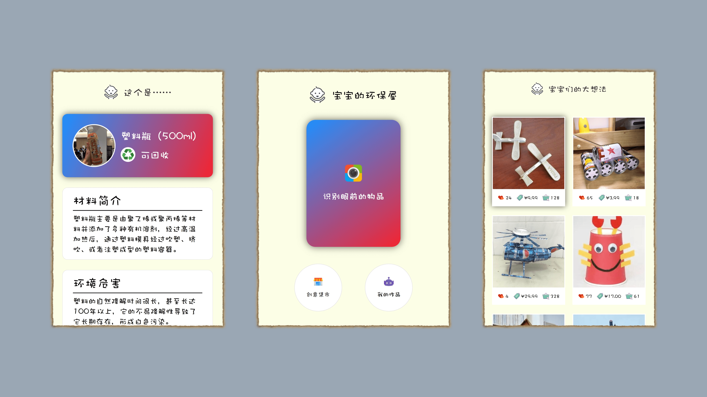
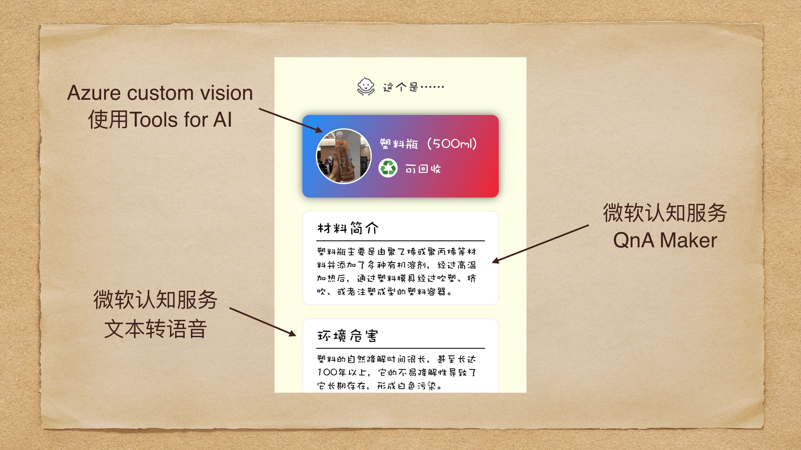

# PlantRoom

🌳 宝宝的环保屋 -- 微软夏令营 Hackathon 项目

> by Jeevan, summer, Griptape & Zephyr. 

## 什么是「宝宝的环保屋」？

一个目的在于**满足孩子求知欲**以及**发动他们动手能力**，来引导孩子**学习并养成环保意识**的应用平台。

## 平台展示

## 社区生态

## 应用技术

## Tips

⚠️ 本 repo 仅作黑客马拉松纪念。不保证代码为最新，且运行情况良好。
